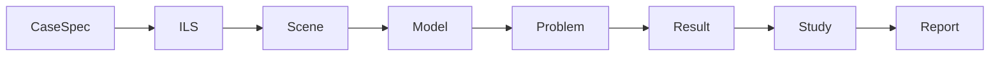

# SLAY Overbend — LLM Build Instruction

**Version:** 1.0 · **Date:** 11 Sep 2026
**Status:** PROPOSED — two open decisions in §9 must be answered before T0 starts.
**Audience:** an LLM coding session starting cold in this repository.

---

## 0. How to use this document

Read §1–§4 in full before writing any code. They are the contract. §5 is the
build order; §6 the task cards; §7 the verification ladder.

Work **one task card at a time**. A card is complete only when its own
`DONE WHEN` clause is satisfied — not when the code runs. Several failure
modes in this project's history produced code that ran correctly and
returned wrong numbers; `§4` exists because of them.

Do not start a card whose `PRECONDITION` is unmet. Do not silently resolve
anything in §9 — raise it.

---

## 1. Context: what already exists

| Thing | Where | Status |
|---|---|---|
| FE kernel (elements, J2 plasticity, assembly, Newton) | `nlfea_v4.py` (repo root) | **FROZEN.** Validated independently. Never edit. |
| Component geometry model (GD-TP/TT/SH/PIP/VLV/B/ST/SB/Con/HdPipe/BrPipe) | `rebuild/component_spec.py` | **MIRRORED** from `Slay-ILS-Designer-V1.0`. Never edit here. |
| Config loader + defaults | `rebuild/config.py`, `rebuild/slay_config.yaml` | **OURS** since 12 Sep 2026 (was mirrored). Editable. Five constants stay shared — see G7. |
| ILS assembly/validation layer | `rebuild/ils_builder.py` | **MIRRORED.** Never edit here. |
| ILS layout fixtures (EDAS) | `rebuild/fixtures/standard_ils_layouts.json` | **MIRRORED DATA.** 7 archetypes + 39 anchors. Re-copy when the source moves; never hand-edit. |
| Line mesher (arc-length, grading, snapping) | `rebuild/slay/model/mesh.py` | **OURS.** Working. Extend, don't rewrite. |
| Old monolithic implementation | `slay_overbend_v1_50.py`, `slay_sliding_v0_4.py` | REFERENCE ONLY. Read for behaviour being reproduced. Never import. |
| Case validation gate | `docs/reference/slay_case.py` | Working code, not yet integrated. Becomes `entry/spec.py` at T8. |
| Geometry prototype (arc-length stations) | `docs/reference/build_geometry_model_STALE.py` | STALE — imports modules that no longer exist. Read for the **arc-length station formulae only**. |
| Architecture + regression baselines | `docs/SLAY_ARCHITECTURE_AND_RESTRUCTURING_PLAN.md` | Current for architecture and §6 baselines. |
| Module aims + resolved decisions | `docs/SLAY_FRESH_BUILD_SPEC.md` | Current. |
| Per-module process + build order | `docs/SLAY_FRESH_BUILD_TASKLIST.md` | Current; superseded on *ordering only* by §5 below (see §5 note). |
| Open design items | `docs/SLAY_MODEL_BUILDING_TRACKER.md` | Item numbers are cited throughout this document. |

**What does not exist:** everything in layers L3, L5, L6, L7 and most of L8.
That is the work.

---

## 2. Architecture contract

### 2.1 Artifact chain

Every layer consumes one immutable artifact and emits the next. No layer
reaches past its neighbour.



### 2.2 Layers

| L | Name | Owns | Frame | Workflow allowed? |
|---|---|---|---|---|
| L1 | Data | constants, material curves | — | **no** |
| L2 | Define | what a component *is*; section/contact at a local position | ILS-local | **no** |
| L3 | Scene | stinger arc, roller stations, deck, ILS placement | world / arc-length | **no** |
| L4 | Model | nodes + elements; discretisation only | world / arc-length | algorithmic only |
| L5 | Physics | sections, materials, contact targets, loads, BCs — one position, inert | world | **no** |
| L6 | Solve | Newton + contact active set + increments | world | **yes** |
| L7 | Study | Mode A / Mode B sweeps, state chaining | — | **yes** |
| L8 | Report | strains, checks, plots, IO | — | thin only |

**Dependency rule:** a module in `L_n` may import from `L_m` only where
`m ≤ n`. This is enforced mechanically by the linter built at T0.

### 2.3 Workflow definitions

- **Pure** — `f(input) → output`. No state, no stages.
- **Algorithmic** — internal iteration producing one deterministic answer,
  self-terminating, carrying nothing out (mesh grading; Newton).
- **Workflow** — sequences stages, carries state between them, branches on
  outcomes.

Workflow exists in exactly three places: L6 (physics iteration), L7 (the
sweep), and the CLI (thin sequencing). Nowhere else.

### 2.4 The two boundary rules

These are what keep workflow out of L1–L5. Treat them as invariants.

**Rule 1 — L5 emits an inert Problem.** A complete, solvable problem for
*one* position, with no knowledge that a sweep exists. If L5 can hand L6 a
finished problem, sweep logic has no channel to reach downward. *The old
code failed exactly here: slot construction was entangled with the sweep,
which is why Mode B ended up borrowing Mode A's machinery.*

**Rule 2 — carried state is explicit.** The solver signature is:

```
solve(problem, state_in=None) -> (Result, state_out)
```

Mode A feeds `state_out` forward; Mode B discards it. Both become one line
at L7 and neither needs its own solver.

### 2.5 Why L2–L4 sit outside the sweep loop

The ILS is welded into the pipe, so it travels **with the material**.
Component boundaries are fixed in material coordinates; the mesh is
therefore **shift-invariant**. What changes per shift is only *which
material point sits under each roller*.

This works because `slay_mesh.py` deliberately excludes rollers from node
placement. Do not add roller-driven nodes — it would force a mesh rebuild
per shift and collapse the L4/L5 boundary.

---

## 3. Per-module process (from the agreed task list)

Every module follows this. No step is skipped; no code before step 4.

1. **Algorithm in plain language** — prose, not a codified spec. Written to
   `docs/modules/<module>_spec.md`.
2. **Review** — user comments on that document.
3. **Flowchart** — mermaid, to `docs/diagrams/`. Skipped only where a module
   genuinely has no control flow, and the exemption is stated explicitly.
4. **Agreement** — algorithm and diagram both signed off.
5. **Code.**
6. **Test with sample input and output** — actual numbers recorded.
7. **Log** — append to the same module document. Never spawn a second file.

---

## 4. Standing rules (guardrails)

Each rule below exists because it was violated once and cost real work.

| # | Rule | Why |
|---|---|---|
| G1 | **Contact never drives node placement.** | Sliding contact sits at a virtual parametric point inside an element and distributes to bracketing nodes by shape functions. A node at the contact point buys nothing. (tracker item 24) |
| G2 | **Arc length, never a projection onto an axis.** | An x-parameterised draft gave 0 elements on vertical members and 44.7% of true length on GD-SB's sloped sides — 11.0% of the frame silently missing. |
| G3 | **Envelope combination is `max`, never `sum`.** | `sum` double-counts where a thick body and shroud overlap; measured +7.9%. `sum` is retained only to reproduce pre-v0.5 numbers, never as a default. |
| G4 | **Never drop a MANDATORY station.** | Slivers from snap-vs-regular collisions made one case fail to converge outright and shifted another's peak by +30% on pure numerical artefact. |
| G5 | **No `k_spring`.** | Tested, rejected 12 Aug 2026 (NaN on a shroud contact-release case). Not reintroduced with any value, including 0. |
| G6 | **Never edit `nlfea_v4.py`.** ⚠ **AMENDMENT PROPOSED — not adopted.** | Frozen, independently validated. Work around it, never in it. *The kernel merges coincident nodes unconditionally, which is wrong for models this program must build; the ruling of 12 Sep 2026 is that it must be fixed. Proposed wording, the three implementation options and the regression cost are in `docs/modules/T3_mesher_test_plan.md` §7. Nothing in `nlfea_v4.py` changes until that is confirmed.* |
| G7 | **Never edit the mirrored files** — `component_spec.py`, `ils_builder.py`. | They belong to `Slay-ILS-Designer-V1.0` and are actively developed there. Local edits desync silently. Needed change → raise it upstream, don't patch. **`config.py` / `slay_config.yaml` came OUT of the mirror on 12 Sep 2026 and are ours to edit** — the mirrored code reads only five constants from them (OD_PIPE_DEF, T_WALL_DEF, STEEL_E, G, RHO_STEEL), guarded by `tests/test_config_ownership.py`. |
| G8 | **"It ran without error" is not verification.** | This codebase has a documented silent-failure mode (`phase1_peak=0.0`, no exception). Every card requires a *number*. |
| G9 | **Never substitute F for P/S/D connectors.** | The solver implements F only. A P/S/D case must be refused, not approximated — it would silently answer a different question. |
| G10 | **Mesh density is 2×OD.** | Matches the paper's own basis. Refining to 1×OD moved *away* from apples-to-apples and was reverted. Do not "improve" it without changing the comparison basis too. |
| G11 | **No sweep/position loop below L7.** | Rule 1. Checked explicitly in each L1–L5 card's workflow audit. |
| G12 | **All constants from `config.py`.** | No literal may appear in a module that `config.py` already supplies. |

---

## 5. Build order

**Note — deliberate refinement of the agreed task list.** The task list
specifies bottom-up construction. This document keeps bottom-up *dependency*
order but scopes the first pass to the **thinnest vertical slice that
produces a validated number** (plain pipe, M1). Pure layer-completion
would yield no checkable number until the final layer, against a project
whose stated review rule (G8) requires a number per change. Each layer is
then thickened in a second pass.

| Task | Layer | Builds | Milestone | Status |
|---|---|---|---|---|
| T0 | — | package scaffold, import linter, test harness | — | ✅ 12 Sep 2026 · `docs/modules/T0_scaffold.md` |
| T1 | L1 | `material()` accessor | — | ✅ 12 Sep 2026 · `docs/modules/T1_materials.md` |
| T2 | L3 | stinger arc, roller stations, deck | — | ✅ 12 Sep 2026 · `docs/modules/T2_scene_spec.md` |
| T3 | L4 | header polyline, junction merge, global numbering | — | spec + test plan RULED 13 Sep; **blocked on G6** (kernel node merge); D2 answered — no `MeshTopology` |
| T4 | L5 | sections, contact targets, loads, BCs, `Problem` | — | |
| T5 | L6 | `solve()` — Newton + active set + increments | **M1** | |
| T6 | L7 | Mode A, Mode B, landing, coverage | **M5** | |
| T7 | L8 | strains, peaks, DNV check, plots, IO | — | |
| T8 | Entry | `spec.py`, `run()`, CLI | — | |
| T9 | L3/L5 | thicken: ILS placement, component contact ownership | **M2–M4** | |

---

## 6. Task cards

### T0 — Scaffold

**PRECONDITION:** §9 decisions answered.

**ACTIONS**
1. Create the package tree under `rebuild/slay/` per §9-D1's chosen naming.
2. Move `slay_mesh.py` into the L4 directory. Move nothing else — mirrored
   files stay where they are and are imported, not relocated.
3. Write `tools/check_layers.py`: parse every module's imports; fail if a
   module in layer *n* imports from layer *m > n*. Exit non-zero on
   violation.
4. Write `tools/run_checks.sh`: runs the layer linter + the test suite.
5. Add `tests/` with one passing smoke test importing `component_spec`
   and `slay_mesh` through the new paths.

**VERIFY** `tools/run_checks.sh` exits 0. Deliberately add a violating
import, confirm the linter exits non-zero, remove it.

**DONE WHEN** the linter demonstrably catches a violation.

---

### T1 — L1 `material()`

**PRECONDITION:** T0 complete.

**ACTIONS**
1. Write `material(name: str)` returning a material object for `'j2'` or
   `'ro'`, built from `config.MATERIAL_*`.
2. `'j2'` → yield/plastic-strain table form. `'ro'` → Ramberg-Osgood
   parameters (`E`, `sig_ys`, `N_RO`, `alpha_DNV`).
3. Raise on an unknown name, naming the valid set.

**VERIFY** `material('j2')` returns a 31-point table with first point
`(360.0e6, 0.0)`. `material('ro')` returns `alpha_DNV == 1.300`.

**NEVER** re-derive `alpha_DNV`. `nlfea_v4.py` states two conflicting
values in its own docstrings (2.278 and 1.300); 1.300 is arithmetically
correct and is what `config.py` carries.

**DONE WHEN** both materials load and the two assertions above pass.

---

### T2 — L3 Scene

**PRECONDITION:** T1 complete. Steps 1–4 of §3 completed for this module.

**INPUTS TO READ FIRST:** `docs/reference/build_geometry_model_STALE.py`
(station formulae only); tracker items 16, 26, 28.

**ACTIONS**
1. `stinger_arc(R, n_sr, spacing)` → arc object exposing `theta(s)`,
   `position(s)`, `tangent(s)`, `normal(s)`, parameterised on **arc length
   `s` from SR1 (`s = 0`)**.
2. `roller_stations(...)` → ordered stations, each carrying: `name`,
   `s_arc`, world `(x, y)`, `radius`, `one_sided` (bool), `normal`.
   - Stinger: `theta_i = (i-1)·spacing/R`; `s = R·theta`;
     `x = -R·sin(theta)`; `y = R·(1-cos(theta))`.
   - Vessel: straight deck, `s = -j·spacing`, `y = 0`.
   - `one_sided` resolved from `config.ONE_SIDED_ROLLERS_DEFAULT`
     (all SR, plus VR1/VR2). Do not hardcode the list.
   - `radius` is **per roller**, defaulting to
     `config.ROLLER_RADIUS_DEF`. Roller OD is not assumed uniform.
3. `lay_extent(stations, sweep_len)` → total pipeline extent including
   sweep buffer (tracker item 2).
4. `build_scene(...)` → **Scene** artifact: arc, stations, deck, extent.

**VERIFY**
- `s` and `x` diverge on the stinger and coincide on the deck. At the
  R=85 default, SR1→SR6 arc length is 40.0 m against a chord sum ~2.07 m
  shorter (tracker item 16 records 2.07 m at R=85, 3.04 m at R=70).
- `normal(0)` points from roller surface toward the pipe. Under
  y-positive-down that is `(0, -1)` — confirm against tracker item 28
  before relying on it.
- `one_sided` is True for every SR and for VR1/VR2, False for VR3+.
- Changing `n_sr` changes the one-sided set automatically.

**WORKFLOW AUDIT** No loop over sweep positions. No mesh. No solver import.

**NEVER** compute node positions here — Scene is placement only.

**DONE WHEN** the four verifications above produce recorded numbers in
`docs/modules/scene_spec.md`.

---

### T3 — L4 Model completion

**PRECONDITION:** T2 complete.

**ACTIONS**
1. `header_polyline(scene, ils)` → one `Polyline` spanning the full
   pipeline: plain pipe + ILS components chained in material order.
   Reuse `slay_mesh.polyline_of`'s contiguity/branching assertions.
2. `merge_junctions(meshes)` → resolve every declared `junctions()` entry
   into a shared node index. **Merge only on declaration, never on
   coordinate coincidence** — coincidence is wrong in both directions
   (GD-B's tee must merge; a GD-ST frame node landing on a pipe x must
   not, and once silently turned a two-point attachment into a
   continuous stiffener).
3. `build_model(scene, ils)` → **Model**: flat node array, element array,
   connectivity, and per-element `line_id` + `owner`.
4. Insert `Connector` elements as 2-node elements at connection points.

**VERIFY** — full plan in `docs/modules/T3_mesher_test_plan.md`, whose
figures are reproduced by `tools/spike_mesher_rig.py`. In outline:
- Plain pipe at 2×OD over the default extent gives the expected element
  count; record it.
- An ILS case: every component's mandatory stations appear as nodes;
  `mesh.warnings` is empty.
- Chain identity is recoverable from `owner`/`line_id` without any
  separate topology object (see §9-D2).
- **The mesher rig**: each archetype centred with 6 m of plain pipe beyond
  each end, the pipeline section applied throughout, both ends fixed in all
  DOF, a point load at the component body centre. One section everywhere
  makes the beam prismatic, so the closed form is exact and *anything the
  mesher does must be invisible in the result*. Run at 20 kN (absolute
  check against the closed form) and at 200 kN (the specified rig; exact
  invariances plus a pinned 2.95e-05 mesh sensitivity).
- **Solver settings are part of the fixture.** `tol = 1e-6`, never the
  default 5e-4 (under-converged, and drifts with increment count) and never
  tighter than 1e-7 (unreachable — `solve_step` then halves the increment and
  retries without bound, raising nothing; a 0.02 s solve ran 15 min).
  Every rig solve needs a harness timeout, because the kernel has none.

**WORKFLOW AUDIT** Grading loop only (algorithmic, pre-existing). No
sweep loop.

**DONE WHEN** both mesh cases report zero warnings and recorded counts.

---

### T4 — L5 Physics

**PRECONDITION:** T3 complete.

**ACTIONS**
1. `bind_sections(model, assembly)` — each element gets its `Section`, or
   `stiffness_ratio`, or resolves `stiffness_rule='section_at'` **per
   element** by querying `assembly.section_at(x)` at the element midpoint.
2. `bind_material(model, material)`.
3. `contact_targets(model, scene, assembly, shift)` — for each roller:
   - map the roller to a **material** position on the header
     (`contact_x_material`), *not* a deformed position;
   - resolve the contact surface via `assembly.contact_at(x)` — this is
     the single source; do not reimplement `envelope_at` (tracker item 18);
   - compute the target normal displacement. Under arc-length node
     positioning the `ux·nx` term is **not** zero; the corrected target is
     `dn = R·(1 − cos θ − θ·sin θ)`. Using the old `arc_y · ny` form here
     gives a 1.05 m target error at SR6 (tracker item 16);
   - emit shape-function coefficients to the two bracketing nodes;
   - carry the roller's `one_sided` flag through.
4. `self_weight(model)` — distributed element weight plus point masses
   from `component.point_masses()`. Weight acts in **+y** (y is
   positive-down); a negative `Fy` here is 3 mT of uplift that still solves.
5. `boundary_conditions(model, scene)`.
6. `build_problem(...)` → **Problem**, complete and inert.

**VERIFY**
- `Problem` is serialisable and contains no reference to shift index,
  sweep length, or any Scene mutation.
- Two `Problem`s built at different shifts differ **only** in contact
  targets — same nodes, same elements, same sections. Assert this
  mechanically; it is the test of §2.5.
- Contact targets for a plain pipe at R=85 match the closed-form
  `R(1 − cos θ − θ sin θ)` at every SR.

**WORKFLOW AUDIT** No loop over shifts. `shift` is an argument, not a
range.

**DONE WHEN** the "differ only in contact targets" assertion passes.

---

### T5 — L6 Solve · **MILESTONE M1**

**PRECONDITION:** T4 complete.

**ACTIONS**
1. `solve(problem, state_in=None) -> (Result, state_out)`.
2. Build the contact active set: engage where the gap closes; release
   where reaction reverses. Honour `one_sided` per roller.
3. Newton loop with adaptive increment cutting and divergence detection.
   Retain `reg_mult` (validated stabiliser).
4. Plastic state freeze/commit, returned in `state_out`.
5. Port the solve logic from `_solve_state_sliding` in
   `slay_sliding_v0_4.py`. **Do not** port `_solve_state` (node-snapped)
   — that path is retired.

**VERIFY — M1, the first real number**
Plain pipe, no ILS, 2×OD mesh:

| R | Expected peak strain |
|---|---|
| 70 m | 0.494% |
| 85 m | 0.384% |
| 100 m | 0.316% |

All three must match. State `R` alongside any quoted figure — these are
three distinct values, not interchangeable.

**NEVER** accept a converged run as a pass. Check the number.

**DONE WHEN** all three plain-pipe values reproduce.

---

### T6 — L7 Study · **MILESTONE M5**

**PRECONDITION:** T5 complete (M1 passing).

**ACTIONS**
1. `mode_a_passage(...)` — chained passage. `state_out` fed forward. J2
   only (path memory is the reason chaining exists).
2. `mode_b_check(...)` — independent position check. `state_in=None`
   every time. J2 **or** RO.
3. The only difference between them is whether `state_out` is carried.
   If any other difference appears, Rule 2 has been broken — stop and
   raise it.
4. `landing(...)` — thin wrapper over Mode B. No solver logic.
5. `coverage_check(study)` — port the turned-over test from
   `docs/reference/slay_case.py`. A peak still rising at the last shift
   is **INCOMPLETE**, reported as such, never read off a plot.

**VERIFY — M5**
B1 SR5 sliding sweep: **1.4028%**, full sweep 9/9 steps, peak at shift
1.50. A result near ~1.334% means the sweep is truncating early — that
is the superseded node-based figure which stopped two steps short and
under-reported by ~5%. It is not a physics change.

**DONE WHEN** M5 reproduces at 9/9 steps and `coverage_check` reports
turned-over.

---

### T7 — L8 Report

**PRECONDITION:** T6 complete.

**ACTIONS**
1. `strains(result, model)` — extreme-fibre strain per element.
2. `peaks(study, by='owner')` — group by `MeshElement.owner`, which
   already carries component identity from T3.
3. `dnv_check(strains)` — wrap the existing `dnv_lcc_strain_calc.py`.
4. `plot_*` — consume Model/Result only. **A plotter computes no
   geometry** (tracker item 27: a plotter once drew the pipe using the
   stinger arc formula, i.e. asserted a result nothing had computed).
5. `save/load/checkpoint`, provenance-tagged.

**VERIFY** Regenerate a known case: visual check **and** peak-value check.
A plot can look right and report the wrong number.

**DONE WHEN** peaks group correctly per component and the DNV check runs
on M1 output.

---

### T8 — Entry

**PRECONDITION:** T7 complete.

**ACTIONS**
1. Move `docs/reference/slay_case.py` → `entry/spec.py`. Update module
   names. Drop the `k_spring` and node-snapping knobs it exposes — those
   paths no longer exist.
2. Reconcile its local constants against `config.py` (G12). Note it
   currently carries `DEFAULT_N_VR = 10`; `config.py` says **3**, which
   is correct. Fix to read from `config.py`, do not restate.
3. `run(case)` — the only place stages are sequenced.
4. `cli()` — `--case`, `--mode {A,B}`, `--batch`, `--checkpoint`.

**VERIFY** Every baseline case in §7, run through the CLI, matches.

**DONE WHEN** the full ladder passes end-to-end from the CLI.

---

### T9 — Thicken · **MILESTONES M2–M4**

**PRECONDITION:** T8 complete.

**ACTIONS** Extend L3 placement and L5 contact ownership to full ILS
cases. No new layers; no new workflow.

**VERIFY**

| Milestone | Case | Expected |
|---|---|---|
| M2 | EA-ST F1, kT=2.52×EI | **0.385%, bit-identical to plain pipe.** Exact equality, not approximate — one shared connector node adds no bending continuity. This is the cheapest structural canary in the suite. |
| M3 | A1, R=70 / R=85 | 0.874% / 0.540%. R=85 needs ≥3 elements across the component; at 2×OD confirm the element count *inside* the component before trusting it. |
| M4 | B1 S2-4 (shroud only) | 1.0764%. Structurally guaranteed regardless of unrelated changes — re-run after every edit as a cheap canary. |

---

## 7. Verification ladder

Each milestone adds exactly one capability. Do not proceed past a failing rung.

| M | Adds | Case | Expected |
|---|---|---|---|
| M1 | first end-to-end solve | plain pipe | 0.494 / 0.384 / 0.316% at R=70/85/100 |
| M2 | connector attachment | EA-ST F1 | 0.385%, bit-identical to plain pipe |
| M3 | section change | A1 | 0.874% (R70), 0.540% (R85) |
| M4 | offset contact surface | B1 S2-4 | 1.0764% |
| M5 | sliding sweep | B1 SR5 | 1.4028%, 9/9 steps, peak at shift 1.50 |

**Known open discrepancy — not a regression.** EA-ST F2 runs 33–40% below
the Abaqus reference on X_c/X_e and correspondingly high on X_i. Attributed
to the frame being modelled as a straight collinear beam rather than a
portal with legs, so it carries no axial stiffness. Do not "fix" this while
building; record it.

### Two verification sources, answering different questions

Do not conflate these. They measure different things and they do not agree
everywhere — the EA-ST F2 note above is one already-recorded instance.

| Source | Question it answers | Size |
|---|---|---|
| Architecture plan §6 | *Does the rebuild reproduce the old CODE?* | 7 rows |
| EDAS anchors (`published`) | *Does the model match the PUBLISHED PAPER?* | 24 (lay, result) pairs across 39 configurations, R ∈ {70, 85, 100}, tension ∈ {100, 120} MT |

§6 remains authoritative for **reproducibility** — it is the contract that
the rebuild did not change behaviour. The anchors are the **validation**
target and are far richer (peak strain, peak moment, and for some cases
X2 strain and phase).

A spot check shows they are not interchangeable: anchor `TP-A1` publishes
0.473% at R=85, where §6 records "A1, R=85m → 0.540%". Whether `TP-A1` and
§6's "A1" are even the same case is **unconfirmed** — §6's note says its A1
needs ≥3 elements across the component at a 1×OD mesh, while the standard
basis is 2×OD (G10). Resolve before quoting either number as the other's
target; see D5.

### L2 geometry fixtures

`rebuild/tests/test_edas_archetypes.py` builds all 7 archetypes and checks
mass, span and extent against the figures recorded alongside them. All 7
currently match exactly. These check **geometry, not physics** — they need
no solver and are the tripwire for the mirrored L2 code being re-synced
upstream without anyone noticing.

`docs/SLAY_ARCHITECTURE_AND_RESTRUCTURING_PLAN.md` §6 is the **only**
authoritative baseline table. A number from a session log or a code comment
is not authoritative — check whether §6 supersedes it. That has already
happened once.

---

## 8. Definition of done (per card)

A card is complete when **all** hold:

1. Steps 1–7 of §3 are done and logged in `docs/modules/<module>_spec.md`.
2. `tools/run_checks.sh` exits 0 — layer linter included.
3. The card's own `VERIFY` clause produced **recorded numbers**, freshly
   solved, not replayed from cache (G8).
4. The workflow audit passed for L1–L5 modules (G11).
5. No mirrored or frozen file was edited (G6, G7).
6. Every constant traces to `config.py` (G12).

---

## 9. Open decisions — do not silently resolve

**D1 — Layer directory naming. RESOLVED 12 Sep 2026: plain names.**
`rebuild/slay/scene/`, `.../physics/`, and so on. Because layer membership
is no longer visible in the path, it is declared in `slay/_layers.py` and
enforced by `tools/check_layers.py` — the linter is not optional under this
choice, it is the entire compensation for it. A permanent test
(`test_layer_linter_catches_violation`) asserts the linter can still fail,
so it cannot quietly become a no-op.

**D2 — Is `MeshTopology` needed?** The 12 Aug architecture plan
(§2.3) specifies a chain-of-node/chain-of-element object to distinguish
the pipe chain from an EA-ST frame chain. It predates `slay_mesh.py`,
which solves the same problem differently: per-line meshing plus
declared junctions, with `MeshElement.owner` already carrying identity.
*Recommendation: drop it; T3 proves chain identity is recoverable
without it.* **Awaiting user.**

**D3 — GD-SB `validate()`.** `BaseStructure.validate()` in the mirrored
`component_spec.py` does not call `super().validate()`, so a negative
`P_c1` builds crossed connector slots. User deferred the fix on 10 Sep
2026. It is a **mirrored file (G7)** — do not fix it here. Raise it
against the source repo when GD-SB work begins.

**D4 — Boss component.** `component_spec.py` marks the Boss (structural
pipe welded to a GD-PIP outer-pipe end node, carrying the connector) as
out of scope. Confirm it stays out before T9.

**D5 — Which source governs the milestone ladder?** §7 now has two, and
they disagree on at least one spot-checked case. Options: keep §6 as the
gate (reproduce the old code first, validate against the paper after), or
promote the EDAS anchors to the primary target (richer, paper-traceable,
but then a mismatch is ambiguous between a rebuild defect and a known
old-code deviation). *Recommendation: §6 gates T5–T8 because reproducing
known behaviour isolates rebuild defects; anchors become the T9 target once
the pipeline is trusted.* Also needs settling: whether `TP-A1` is §6's
"A1", and at which mesh density each was run. **Awaiting user.**

**EDES is not a build input.** Recorded here because the question will
recur. The `EDES_GD-*_KNOWLEDGE.json` files are narrative knowledge —
sourceRef, edges, design-code scope, verification status, prose findings.
They inform design reasoning and provenance in the ILS-Designer repo.
`component_spec.py` is the executable form of the same knowledge, and it
is what this pipeline builds from. Do not attempt to construct geometry
from EDES.

---

## 10. Change log

| Date | Change |
|---|---|
| 11 Sep 2026 | v1.0 — initial. Layers, artifact chain, and workflow map agreed in session; build order refined to a vertical-slice-first sequence (§5 note); D1/D2 raised. |
| 12 Sep 2026 | D1 resolved (plain names). T0 complete. `slay_mesh.py` → `slay/model/mesh.py`. Status column added to §5. D2 still open, due at T3. |
| 13 Sep 2026 | T3 rulings: ILS-local +x toward the vessel (placement is a pure translation, `s = s_centre − x_local`); 6 m of plain pipe beyond each component end; full junction machinery against all seven archetypes; the 20 kN case confirmed alongside 200 kN with peak stress/strain plotted per component. Connector modelling restated as an open question with a recommendation (`T3_mesher_test_plan.md` §13). G6 is now the only blocker on T3 implementation. |
| 12 Sep 2026 | T3 mesher test plan drafted (`docs/modules/T3_mesher_test_plan.md`) with `tools/spike_mesher_rig.py` as its measuring instrument. **G6 flagged for amendment** — the kernel merges coincident nodes and the ruling is that it must be fixed; wording and options are in the plan §7, and nothing is edited until confirmed. |
| 12 Sep 2026 | T1 complete. EDAS layouts vendored as L2 fixtures; second verification source (published anchors) recorded in §7; D5 raised on which source gates the ladder. EDES noted as not a build input. |
| 12 Sep 2026 | T2 complete. Layout diagram generated from Scene (SVG, to scale). Model extent left at the station span for now — the end zones therefore cover SR5/SR6; deferred, see T2 spec §9. |
| 12 Sep 2026 | Elastic end zones ruled in (16 m both ends, fully elastic) — NEW behaviour, needs per-element material binding at L5 and a MANDATORY station at L4; may shift §6 baselines if any peak sat in an end zone. `n_sr` ruled to exclude the tip station. |
| 12 Sep 2026 | Roller layout ruled: SR1 at θ=0 on the deck line, VR1 first inboard of SR1, n_vr=5 counting all vessel stations with VR5 fixed, VR1–VR2 one-sided. Config ownership moved to this repo (the mirrored code reads only five constants); G7 narrowed to `component_spec.py` + `ils_builder.py`. T2 unblocked. |
